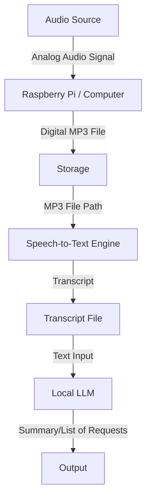

# Project Title

A brief description of your project.

## Project Overview

This project involves connecting a radio to a Raspberry Pi and saving the radio's audio input as an MP3 file. The goal is to automate the process of recording radio audio and processing it for further use.

## System Diagram



## Step 1: Record Radio Input to MP3

**Objective:** Capture the audio signal from the radio, connected to the Raspberry Pi (typically via the audio input or USB sound card), and save it as an MP3 file.

**Approach:**
 Use a USB sound card, the Pi's audio input, or even a basic microphone to receive the audio signal. For a minimum viable product, simply connect a microphone and process its input.

**Example Command:**
```sh
arecord -D plughw:1,0 -f cd -t wav | lame -r - output.mp3
```
*Adjust the device number (`plughw:1,0`) as needed for your setup.*

Further steps will build on this foundation.

## Step 2: Transcribe MP3 with Local LLM

**Objective:** Convert the recorded MP3 audio into a text transcript using a local Large Language Model (LLM) or speech-to-text engine.

**Approach:**
- Use an open-source speech-to-text model (such as Whisper, Vosk, or similar) running locally on the Raspberry Pi or another computer.
- Feed the MP3 file to the model to generate a transcript.
- Save the transcript as a text file for further processing.

**Example Command (using Whisper):**
```sh
whisper output.mp3 --model base --language en --output_format txt
```
*Replace with your chosen tool and adjust parameters as needed.*

The transcript can then be used for further analysis or automation in later steps.

## Step 3: Translate and Summarize Requests with Local LLM

**Objective:** Use a local LLM to translate the transcript (if needed) and extract/summarize a list of requests mentioned in the audio.

**Approach:**
- Use a local LLM (such as a local deployment of Llama, GPT4All, or similar) to process the transcript.
- Translate the transcript to the desired language if it is not already in the target language.
- Analyze the transcript to identify and summarize any requests or actionable items mentioned.
- Output a structured summary or list of requests for further processing or automation.

**Example Workflow:**
1. Pass the transcript to the LLM with a prompt to translate and extract requests.
2. Save the summary or list of requests to a file or database.

This step enables automated understanding and response to radio communications.

## Table of Contents
- [Introduction](#introduction)
- [Installation](#installation)
- [Usage](#usage)
- [Contributing](#contributing)
- [License](#license)

## Introduction

Describe the purpose and goals of your project here.

## Installation

Instructions on how to install or set up your project.

## Usage

Examples and instructions for using your project.

## Contributing

Guidelines for contributing to the project.

## License

Specify the license for your project.
